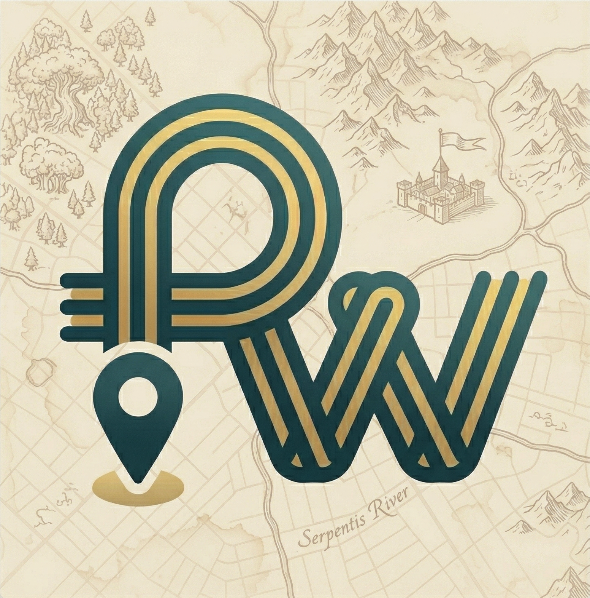
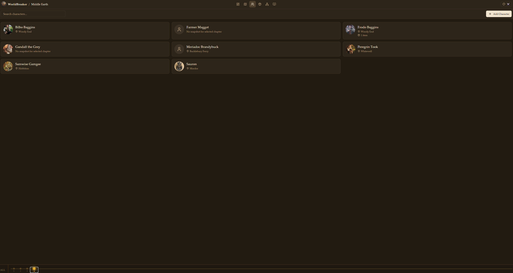
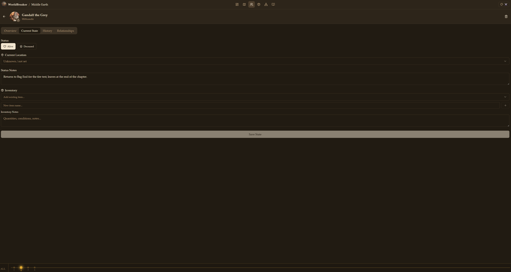
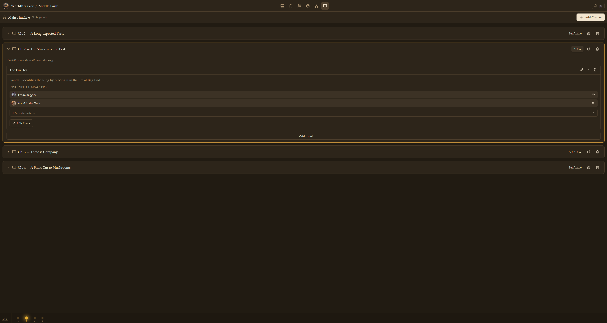
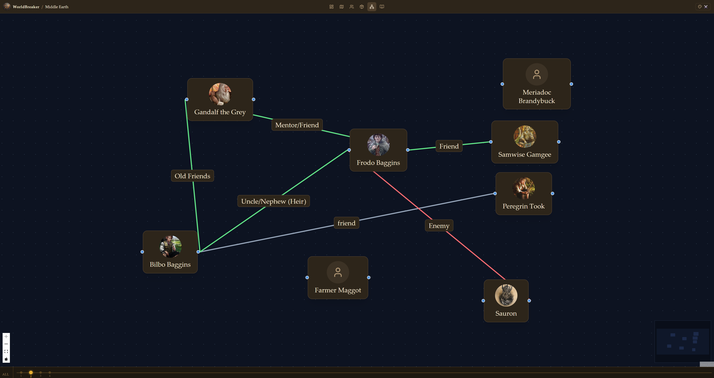

# PlotWeave

<p align="center">
  
</p>

A visual story-tracking web app for writers who need to keep track of characters, locations, relationships, and events across their stories — built to be used alongside tools like Word or Scrivener.

> **This project was entirely generated by [Claude Code](https://claude.ai/code) (Anthropic's AI coding assistant) through a conversational development session. No code was written by hand.**

---

## What it does

When writing long stories it's easy to lose track of where a character is, what they're carrying, or who they know. PlotWeave solves this by giving you a visual workspace tied to a **chapter cursor** — every piece of state (character location, inventory, relationships, status) is recorded per chapter, so you can jump to any point in your story and instantly see an accurate snapshot of the world.

---

## Screenshots

### Map Explorer

*Upload any image as a map. Characters appear as pins at their chapter-specific locations. The themed timeline bar runs along the bottom with a callout showing the active chapter.*


*Drill into sub-maps (e.g. world → region → city). Character movement paths are drawn between waypoints. Selecting a character opens a snapshot panel showing their inventory, location, status, and relationships.*

### Characters

*The character roster shows every character with their portrait, current location, and alive/dead status for the active chapter.*


*Each character has four tabs: Overview (bio), Current State (chapter snapshot — location, inventory, status), History (all snapshots across chapters), and Relationships.*

### Timeline

*The timeline organises chapters in sequence. Each chapter can have events attached, with involved characters listed. Set any chapter as "active" to filter every other view to that point in time.*

### Relationship Graph

*A ReactFlow-powered network of character relationships. Edge colours indicate sentiment (green = positive, grey = neutral, red = negative, yellow = complex). Relationships can be chapter-scoped so they only appear from the chapter they were created.*

---

## Features

### Worlds
- **Multi-world support** — manage completely separate stories, each with their own characters, maps, timelines, items, and relationships
- **World dashboard** — overview of all your worlds with create, export, and delete actions

### Chapter Timeline Bar
- **Fixed bottom overlay** — a persistent themed timeline bar visible on every non-dashboard page
- **Chapter markers** — dot-track with one marker per chapter; click to set the active chapter cursor
- **Callout** — a floating info card appears above the active marker showing the chapter title, synopsis, and prev/next navigation chevrons; auto-dismisses after 4 seconds
- **"All" deselect** — a button on the left of the bar resets the chapter cursor to show unfiltered data
- **Playback controls** — Play/Pause, Stop, and Speed buttons built into the timeline bar for story playback mode
- **Chapter diff** — a compare icon appears in the timeline bar whenever a chapter is active; click it to open a side-by-side diff of any two chapters showing character moves, relationship changes, and item relocations
- **Theme-aware** — the bar's colours, fonts, glow effects, and pulse animations all update instantly with the active theme

### Maps
- **Custom image maps** — upload any image (PNG, JPG, hand-drawn, scanned) as a map using Leaflet with `CRS.Simple`
- **Nested sub-maps** — link a location marker to a child map (e.g. world → region → city), with full drill-down navigation and a breadcrumb trail
- **Map tree sidebar** — browse the full map hierarchy and jump to any layer instantly
- **Location markers** — place named markers on the map by clicking; each can have a description, icon type, and a linked sub-map
- **Character pins** — characters are shown on the map at their chapter-specific location; characters inside a sub-map appear on parent maps at the entry-point marker
- **Drag-and-drop placement** — drag character cards from the sidebar directly onto a location marker to place them; dragging onto empty map space automatically creates a new location marker at that spot
- **Movement trails** — per-chapter waypoints are recorded and drawn as coloured paths on the map; each trail segment shows its own distance label when the map has a scale configured
- **Sub-maps fill the canvas** — when navigating into a nested map, the image always expands to fill the full canvas area
- **Item placement** — place world items at specific locations per chapter; items show their image thumbnail in the location panel and the items sidebar
- **Character snapshot panel** — click any character pin to open a sidebar with their portrait, status, location, inventory (with item images), and relationships

### Characters
- **Character roster** — searchable grid of all characters with portrait images and chapter-aware location/status
- **Per-chapter snapshots** — record each character's alive/dead status, current location, inventory, status notes, and inventory notes independently per chapter
- **Portrait images** — upload a portrait for each character; shown throughout the app (roster, map pins, relationship graph, timeline cards)
- **History tab** — view all snapshots across every chapter in chronological order
- **Overview tab** — bio, role, and general character notes

### Relationships
- **Visual relationship graph** — ReactFlow canvas showing the full network of character relationships
- **Sentiment & strength** — each relationship has a sentiment (positive / neutral / negative / complex) shown as edge colour, and a strength (weak / moderate / strong / bond)
- **Chapter-scoped relationships** — relationships have a `startChapterId` so they only appear from the chapter they were created; earlier chapters show a filtered graph
- **Snapshot inheritance** — relationship state carries forward automatically from the most recent chapter snapshot ≤ the active chapter
- **Inherited state indicator** — edges from an inherited (not current-chapter) snapshot are shown as dashed lines with a note in the sidebar
- **Per-chapter overrides** — click any relationship edge to open a sidebar where you can set or override the relationship state for the active chapter
- **End a relationship** — mark a relationship as inactive in a specific chapter without deleting it globally

### Timeline
- **Timelines and chapters** — organise your story into one or more timelines, each with ordered chapters
- **Chapter events** — attach named events to any chapter with a synopsis and involved characters
- **Chapter snapshot cards** — the timeline view shows a snapshot card per character per chapter, including location, inventory items (with images), and status

### Story Playback
- **Play the Story So Far** — hit Play in the timeline bar to automatically advance through every chapter in sequence
- **Animated character travel** — character pins glide smoothly across the map from their previous chapter position to their new one, simulating movement through the story world
- **Cinematic notes overlay** — while a chapter is held, all characters' status notes for that chapter are displayed as continuous prose in the centre of the screen, with character names highlighted; the text auto-scrolls if it is longer than the visible area
- **Speed control** — switch between Slow, Normal, and Fast playback speeds; character travel animation adjusts accordingly
- **Full hold on last chapter** — the final chapter waits the full hold duration before stopping, giving you time to see the last movements and read the notes
- **Auto-stop** — playback stops cleanly after the last chapter; pressing Stop at any time returns the timeline cursor to where it was

### Items
- **Item catalogue** — a world-level catalogue of all props, artefacts, weapons, and key items
- **Item images** — upload an image for each item; shown everywhere items appear (roster cards, inventory lists, location panels, map sidebar, timeline snapshot cards)
- **Per-chapter placement** — place items at map locations or in character inventories per chapter; moving an item removes it from its previous owner/location automatically
- **Item detail view** — name, description, icon type, image upload, and a full edit/delete interface

### Global Search
- **Command palette** — press `Ctrl+K` (or `⌘K` on Mac) from anywhere in the app to open a full-text search palette
- **Searches everything** — characters, items, location markers, chapters, events, timelines, and relationships all searched simultaneously
- **Grouped results** — results are grouped by entity type with colour-coded icons and the matching text highlighted inline
- **Keyboard navigation** — use ↑↓ to move through results, Enter to navigate, Esc to dismiss

### Writer's Brief
- **Chapter summary panel** — click the scroll icon in the top-right to open a slide-in panel showing everything relevant to the active chapter
- **At a glance** — displays the chapter title and synopsis, all events, each character's current location / alive status / status notes / inventory, all relationship states recorded for that chapter, and every item placed at a location
- **Always in sync** — the panel reads live from the database so it reflects edits made anywhere else in the app immediately

### Themes
Nine visual profiles that instantly transform the entire app — backgrounds, borders, fonts, border-radius, glow intensities, timeline animations, map callouts, and character panels all update together:

| Theme | Palette | Font | Character |
|---|---|---|---|
| 🌑 Dark Slate | Slate-900 blues | Inter sans-serif | Professional default |
| ⚔️ Fantasy | Parchment & gold | Palatino serif | Ornate amber glows |
| 🚀 Sci-Fi | Frosted glass & cyan | Monospace | Backdrop blur, scan lines |
| 🤖 Cyberpunk | Neon pink & yellow | Monospace bold | Hard edges, fast flicker pulse |
| 🩸 Horror | Charcoal & blood-red | Palatino serif | Deep vignette, slow throb |
| 🤠 Western | Leather & copper | Palatino serif | Warm sepia shadows |
| 💥 Action | Gunmetal & orange | Impact bold-italic | Diagonal texture, sharp frames |
| 🎬 Noir | Monochrome near-black | Playfair Display serif | Corner vignette, dramatic shadows |
| 🌹 Romance | Dark rose & rose-gold | Georgia serif | Soft glow, very rounded corners |

### Export / Import
- **`.pwk` format** — export any world to a single JSON file containing all data and base64-encoded images
- **Full fidelity** — characters, maps, location markers, timelines, chapters, events, items, relationships, snapshots, movement paths, images, and relationship graph positions are all included
- **Backward compatible** — older `.pwk` files missing newer fields (`startChapterId`, `scalePixelsPerUnit`, `scaleUnit`, `synopsis`) are normalised on import
- **One-click restore** — import a `.pwk` file to restore an entire world, including all images

### Data & Privacy
- **Fully local** — all data lives on your machine via IndexedDB (Dexie.js); nothing is sent to any server
- **No account required** — open the app and start writing
- **Works offline** — no internet connection needed

---

## Tech stack

| Concern | Library |
|---|---|
| Desktop shell | Electron 41 + electron-forge |
| Framework | React 19 + TypeScript |
| Build tool | Vite 8 |
| Database | Dexie.js (IndexedDB) |
| UI state | Zustand (with persistence) |
| Routing | React Router v7 |
| Maps | Leaflet + react-leaflet (`CRS.Simple` for custom images) |
| Relationship graph | ReactFlow v11 |
| Styling | Tailwind CSS v4 + CSS custom properties |
| Icons | Lucide React |
| Testing | Vitest + fake-indexeddb |

---

## Download

Download the latest installer for your platform from the [Releases page](https://github.com/SirFoxworthTheThird/PlotWeave/releases):

| Platform | File |
|----------|------|
| Windows  | `PlotWeave-*-Setup.exe` — run the installer |
| macOS    | `PlotWeave-*.zip` — unzip and drag to Applications. On first launch, right-click → Open if macOS warns about the developer. |
| Linux    | `plotweave_*.deb` — install with `sudo dpkg -i plotweave_*.deb` |

---

## Development

```bash
# Install dependencies
npm install

# Start the app in dev mode (Vite + Electron)
npm run electron:dev
```

```bash
# Run tests
npm run test

# Production build (Vite only)
npm run build

# Package the app for the current platform
npm run electron:make
```

---

## How to use

1. **Create a world** from the home screen
2. **Upload a map** image (PNG, JPG, etc.) in the Maps tab
3. **Add location markers** by clicking on the map
4. **Add characters** in the Characters tab
5. **Create chapters** in the Timeline tab
6. **Select a chapter** from the bottom timeline bar — this sets the time cursor for every view
7. **Place characters** on the map by dragging them from the sidebar onto a location marker
8. **Track inventory** in the character's Current State tab — items can also be placed at map locations
9. **Build the relationship graph** in the Relationships tab — add relationships with sentiment and strength, scoped to the active chapter
10. **Export your world** from the world card on the dashboard to create a `.pwk` backup file
11. **Play the Story So Far** — press Play in the timeline bar to animate your characters through all chapters with cinematic notes
12. **Compare chapters** — click the compare icon in the timeline bar to diff any two chapters and see exactly what changed
13. **Open the Writer's Brief** — click the scroll icon in the top-right for a full summary of the active chapter
14. **Search your world** — press `Ctrl+K` to find any character, location, chapter, or item instantly

---

## Project structure

```
src/
  features/
    worlds/        # World selector, world cards, dashboard
    maps/          # Leaflet canvas, map tree nav, location panels, character snapshot panel
    characters/    # Character roster, detail view, snapshot tabs (state/history/relationships)
    relationships/ # ReactFlow relationship graph, snapshot editor
    timeline/      # Timeline view, chapter rows, event cards, snapshot cards
    items/         # Item roster, item detail, create dialog
  db/
    database.ts    # Dexie schema and migrations (v1–v7)
    hooks/         # useLiveQuery hooks per entity
  store/
    index.ts       # Zustand store (activeWorld, activeChapter, theme, map history)
  lib/
    exportImport.ts # .pwk export/import with base64 blob serialisation
  components/
    ChapterTimelineBar.tsx  # Fixed bottom themed timeline overlay
    ThemePicker.tsx         # Theme switcher + ThemeProvider
    PortraitImage.tsx       # Blob-backed image with fallback icon
    AppShell.tsx            # Layout shell with TopBar and timeline
  types/           # TypeScript interfaces for all entities
```

---

## AI generation note

This entire codebase — every component, hook, type, test, and configuration file — was written by **Claude Code** (model: `claude-sonnet-4-6`) through conversational prompts. No code was written manually. The human's role was to describe features, report bugs, and request changes in plain language.

---

## License

MIT
